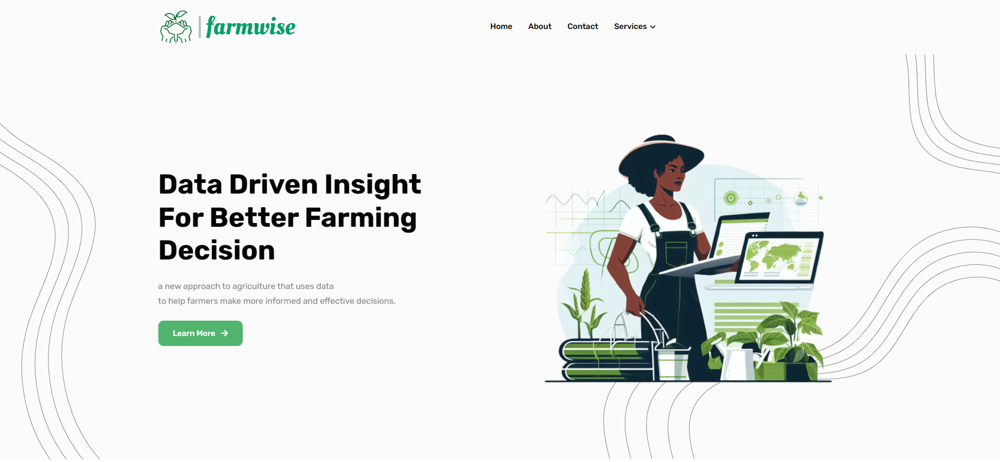

<h1 align="center" id="title">Farmwise</h1>

<p align="center"></p>

<p id="description">This project uses machine learning to provide farmers with personalized recommendations for fertilizer crop selection yield prediction and crop disease detection. We use a variety of data sources to train our machine learning models. Our models are then able to generate accurate and personalized recommendations for each farmer based on their unique circumstances.</p>


# Built with 🛠️
<code></code>
<code></code>
<code></code>
<code></code>
<code></code>
<code></code>
<code></code>
<code></code>

<code></code>
<code></code>
<code></code>
<code></code>
<code></code>

## DEPLOYMENT 🚀


#### This website is deployed at [AWS Ec2]
#### You can access it [here](http://ec2-52-15-93-123.us-east-2.compute.amazonaws.com:8080/)
#### Note: The website may take a minute to load sometimes
## How to use 💻

- Crop Recommendation system ==> enter the corresponding nutrient values of your soil, state and city. Note that, the N-P-K (Nitrogen-Phosphorous-Pottasium) values to be entered should be the ratio between them. Refer [this website](https://www.gardeningknowhow.com/garden-how-to/soil-fertilizers/fertilizer-numbers-npk.htm) for more information.
Note: When you enter the city name, make sure to enter mostly common city names. Remote cities/towns may not be available in the [Weather API](https://openweathermap.org/) from where humidity, temperature data is fetched.

- Fertilizer suggestion system ==> Enter the nutrient contents of your soil and the crop you want to grow. The algorithm will tell which nutrient the soil has excess of or lacks. Accordingly, it will give suggestions for buying fertilizers.

- Disease Detection System ==> Upload an image of leaf of your plant. The algorithm will tell the crop type and whether it is diseased or healthy. If it is diseased, it will tell you the cause of the disease and suggest you how to prevent/cure the disease accordingly.
Note that, for now it only supports following crops

<details>
  <summary>Supported crops
</summary>

- Apple
- Blueberry
- Cherry
- Corn
- Grape
- Pepper
- Orange
- Peach
- Potato
- Soybean
- Strawberry
- Tomato
- Squash
- Raspberry
</details>

## How to run locally 🛠️
- Before the following steps make sure you have [git](https://git-scm.com/download), [Anaconda](https://www.anaconda.com/) or [miniconda](https://docs.conda.io/en/latest/miniconda.html) installed on your system
- Clone the complete project with `git clone https://github.com/Gladiator07/Harvestify.git` or you can just download the code and unzip it
- **Note:** The master branch doesn't have the updated code used for deployment, to download the updated code used for deployment you can use the following command
  ```
  ❯ git clone -b deploy https://github.com/Yididya-K/Farmwise.git 
  ```
  
- Once the project is cloned, open anaconda prompt in the directory where the project was cloned and paste the following block
  ```
  conda create -n farmwise python=3.6.12
  conda activate farmwise
  pip install -r requirements.txt
  ```
- And finally run the project with
  ```
  python app.py
  ```
- Open the localhost url provided after running `app.py` and now you can use the project locally in your web browser.
## DEMO
## Homepage
- 
## services
 

